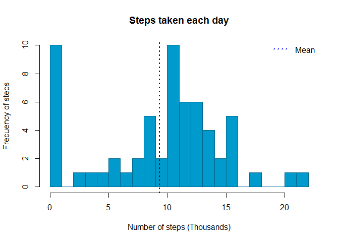
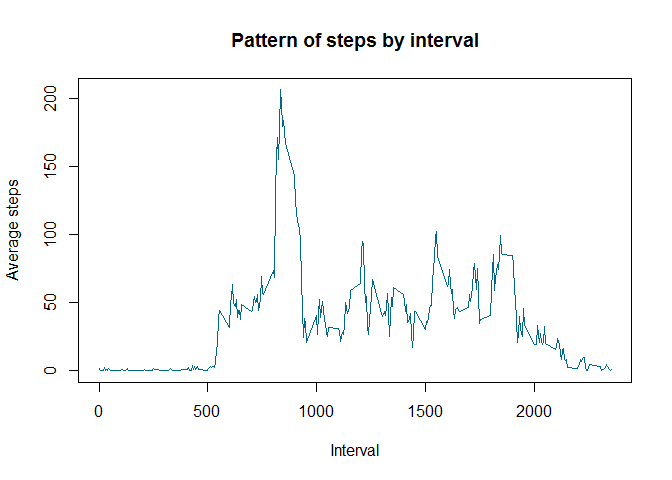
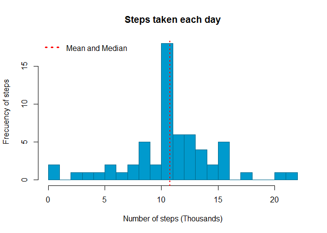
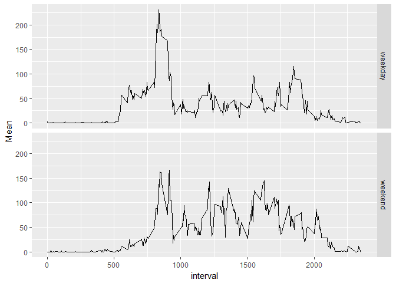

# Reproducible Research: Peer Assessment 1


## Loading and preprocessing the data
The next code download and unzip the csv file data into temporal folder:


```r
temp <- tempdir()
urlfile<-"https://d396qusza40orc.cloudfront.net/repdata%2Fdata%2Factivity.zip"

if(!file.exists(paste(temp,"data.zip",sep = "/"))){
      #dir.create(paste(temp,"data",sep = "/"))
      download.file(urlfile, paste(temp,"data.zip",sep="/"))
      }
unzip(paste(temp,"data.zip",sep="/"), exdir = paste(temp,"data",sep = "/"))
```

Now, we read the csv file in R and coercing dates

```r
activity<-read.csv(paste(temp,"data","activity.csv",sep="/"))
activity$date<-as.Date(activity$date, format="%Y-%m-%d")
```

## What is mean total number of steps taken per day?
### 1. Total number of steps taken per day

```r
require(data.table)
StepsPerDay<-data.table(activity)[, list(StepsPerDay=sum(steps, na.rm = T)), by=c("date")]
head(StepsPerDay,10)
```

```
##           date StepsPerDay
##  1: 2012-10-01           0
##  2: 2012-10-02         126
##  3: 2012-10-03       11352
##  4: 2012-10-04       12116
##  5: 2012-10-05       13294
##  6: 2012-10-06       15420
##  7: 2012-10-07       11015
##  8: 2012-10-08           0
##  9: 2012-10-09       12811
## 10: 2012-10-10        9900
```

### 2. Histogram of the total number of steps taken each day

```r
hist(StepsPerDay$StepsPerDay/1000, main = "Steps taken each day", 
     xlab = "Number of steps (Thousands)", ylab="Frecuency of steps", 
     col="deepskyblue3", border = "deepskyblue4", breaks = 20)
abline(v=mean(StepsPerDay$StepsPerDay/1000), lty=3, lwd=2, col="blue")
legend(legend="Mean", "topright", lty=3, lwd=2, col="blue",bty = "n")
```

<!-- -->

### 3. The mean and median of the total number of steps taken per day

```r
mean(StepsPerDay$StepsPerDay)
```

```
## [1] 9354.23
```

```r
median(StepsPerDay$StepsPerDay)
```

```
## [1] 10395
```

## What is the average daily activity pattern?
### 1. Time series plot of the 5-minute interval and the average number of steps taken averaged across all days.

```r
PatternMean<-data.table(activity)[, list(Mean=mean(steps, na.rm = T)), by=c("interval")]
head(PatternMean,10)
```

```
##     interval      Mean
##  1:        0 1.7169811
##  2:        5 0.3396226
##  3:       10 0.1320755
##  4:       15 0.1509434
##  5:       20 0.0754717
##  6:       25 2.0943396
##  7:       30 0.5283019
##  8:       35 0.8679245
##  9:       40 0.0000000
## 10:       45 1.4716981
```

```r
plot(PatternMean$interval, PatternMean$Mean, type = "l", col="deepskyblue4",
     main = "Pattern of steps by interval", xlab="Interval", ylab = "Average steps")
```

<!-- -->

### 2. Which 5-minute interval, on average across all the days in the dataset, contains the maximum number of steps?

```r
maxInterval<-PatternMean$interval[which.max(PatternMean$Mean)]
```
The interval with the maximun average steps is the 835, with 206.17 average steps.

## Imputing missing values
### 1. Total number of missing values in the dataset

```r
require(dplyr)
dim(filter(activity, is.na(steps)))[1]
```

```
## [1] 2304
```

### 2. Strategy for filling in all of the missing values in the dataset.
We use the mean for that 5-minute interval:

```r
fillData<-merge(activity,PatternMean, by="interval", all.x = T)
fillData<-mutate(fillData, steps=ifelse(is.na(steps),Mean,steps)) 
head(fillData, 10)
```

```
##    interval    steps       date     Mean
## 1         0 1.716981 2012-10-01 1.716981
## 2         0 0.000000 2012-11-23 1.716981
## 3         0 0.000000 2012-10-28 1.716981
## 4         0 0.000000 2012-11-06 1.716981
## 5         0 0.000000 2012-11-24 1.716981
## 6         0 0.000000 2012-11-15 1.716981
## 7         0 0.000000 2012-10-20 1.716981
## 8         0 0.000000 2012-11-16 1.716981
## 9         0 0.000000 2012-11-07 1.716981
## 10        0 0.000000 2012-11-25 1.716981
```

### 3. New dataset that is equal to the original dataset but with the missing data filled in

```r
fillData<-select(fillData, steps, date, interval)
fillData<-fillData[order(fillData$date),]
head(fillData, 10)
```

```
##         steps       date interval
## 1   1.7169811 2012-10-01        0
## 63  0.3396226 2012-10-01        5
## 128 0.1320755 2012-10-01       10
## 205 0.1509434 2012-10-01       15
## 264 0.0754717 2012-10-01       20
## 327 2.0943396 2012-10-01       25
## 376 0.5283019 2012-10-01       30
## 481 0.8679245 2012-10-01       35
## 495 0.0000000 2012-10-01       40
## 552 1.4716981 2012-10-01       45
```

### 4. Histogram and impact of missing values

```r
StepsPerDay2<-data.table(fillData)[, list(StepsPerDay=sum(steps, na.rm = T)), by=c("date")]
hist(StepsPerDay2$StepsPerDay/1000, main = "Steps taken each day", 
     xlab = "Number of steps (Thousands)", ylab="Frecuency of steps", 
     col="deepskyblue3", border = "deepskyblue4", breaks = 20)
abline(v=mean(StepsPerDay2$StepsPerDay/1000), lty=3, lwd=2, col="blue")
abline(v=median(StepsPerDay2$StepsPerDay/1000), lty=3, lwd=2, col="red")
legend(legend="Mean and Median", "topleft", lty=3, lwd=3, col="red",bty = "n")
```

<!-- -->


## Are there differences in activity patterns between weekdays and weekends?
### 1. New factor variable in the dataset with two levels – “weekday” and “weekend”

```r
require(dplyr, lubridate)
WeekDay<-function(date){
      if(wday(date) %in% c(1,7)) TypeDay<-"weekend"
      else {
            TypeDay<-"weekday"
      }
      return(TypeDay)
}

fillData<-mutate(fillData, TypeDay=as.factor(sapply(date, WeekDay)))
levels(fillData$TypeDay)
```

```
## [1] "weekday" "weekend"
```

```r
table(fillData$TypeDay)
```

```
## 
## weekday weekend 
##   12960    4608
```

### 2. Panel plot containing a time series plot (i.e. type = "l") of the 5-minute interval (x-axis) and the average number of steps taken, averaged across all weekday days or weekend days (y-axis)


```r
require(ggplot2)
DailyPattern<-data.table(fillData)[, list(Mean=mean(steps, na.rm = T)), by=c("interval","TypeDay")]
head(DailyPattern,10)
```

```
##     interval TypeDay       Mean
##  1:        0 weekday 2.25115304
##  2:        5 weekday 0.44528302
##  3:       10 weekday 0.17316562
##  4:       15 weekday 0.19790356
##  5:       20 weekday 0.09895178
##  6:       25 weekday 1.59035639
##  7:       30 weekday 0.69266247
##  8:       35 weekday 1.13794549
##  9:       40 weekday 0.00000000
## 10:       45 weekday 1.79622642
```

```r
p <- ggplot(DailyPattern, aes(interval, Mean)) + geom_line()
p + facet_grid(TypeDay ~ .)
```

<!-- -->


